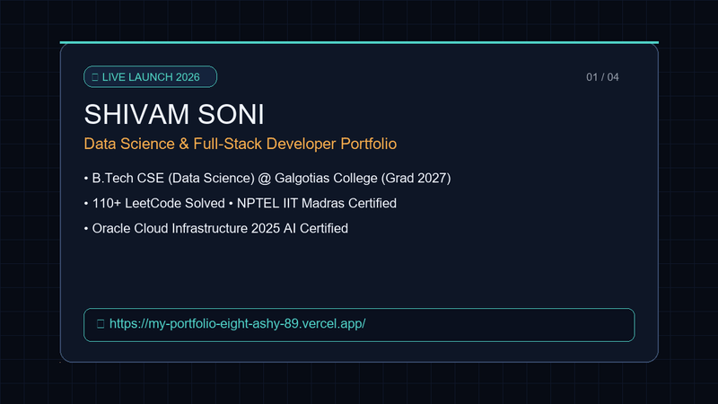

# 🚀 Shivam Soni — Data Science & Software Engineering Portfolio

[](https://my-portfolio-eight-ashy-89.vercel.app/)
[](https://www.linkedin.com/in/shivamsonitech/)
[](https://github.com/Shivam95800)
[](mailto:shivam301102@gmail.com)

A modern, high-performance, ultra-interactive developer portfolio website built with a **Cyber Glass & Python Notebook aesthetic**.

<p align="center">
  
</p>

---

## 🌟 Key Features

- 🖥️ **Interactive Terminal Hero:** Live Python REPL terminal supporting commands (`ds.predict()`, `ds.skills()`, `ds.stats()`).
- 🤖 **"Ask Shivam AI" Assistant:** Floating AI chatbot ready 24/7 to answer recruiter queries regarding background, education, CGPA, projects, and contact info.
- ⚡ **Spotlight Command Palette (`Ctrl + K`):** Fast, keyboard-first navigation inspired by Raycast and VS Code.
- 🚀 **12 Deployed Projects Showcase:** Filterable by category (*AI & Vision, Full-Stack & Web, NLP & Chatbots, DSA & Java*) with live demos and GitHub source code.
- 🏆 **Verified Certifications Suite:** View official certificate PDFs directly on the website:
  - **OCI 2025 Certified AI Foundations Associate** (Oracle University)
  - **Introduction to Machine Learning** (NPTEL - IIT Madras)
  - **Java Programming Fundamentals** (Infosys Springboard)
  - **HTML - Advanced** (Infosys Springboard)
  - **Web Development Virtual Internship Offer** (CodSoft)
- 🔊 **Web Audio API SFX:** Zero-latency sci-fi synthesized sound effects on hover and click with a navbar audio mute toggle.
- 🎬 **AI Guided Walkthrough Tour:** One-click cinematic presentation that scrolls, spotlights, and demonstrates key features step-by-step.
- 🎨 **3 Cyber Glass Themes:** Switch on-the-fly between *Cyber Teal*, *Neon Amber*, and *Neural Purple*.

---

## 📂 Project Structure

```text
Portfolio/
├── index.html              # Main semantic HTML5 document
├── css/
│   └── style.css           # Glassmorphism tokens, animations, responsive breakpoints
├── js/
│   └── main.js             # Terminal REPL, Command Palette, AI Bot, SFX, Tour Engine
├── assets/
│   ├── profile.jpg         # Profile photograph
│   ├── resume.pdf          # Official resume
│   ├── portfolio_ai_demo.gif  # AI animated video showcase
│   ├── portfolio_ai_demo.webp # High-resolution WebP animation
│   └── certificates/       # Official verified PDF credentials
│       ├── oracle-cloud-ai-foundations.pdf
│       ├── nptel-iit-madras-machine-learning.pdf
│       ├── infosys-java-programming-fundamentals.pdf
│       ├── infosys-html-advanced.pdf
│       └── codsoft-internship-offer-letter.pdf
└── README.md               # Documentation and showcase guide
```

---

## 🌐 Live Deployment

- **Vercel Production:** [https://my-portfolio-eight-ashy-89.vercel.app/](https://my-portfolio-eight-ashy-89.vercel.app/)
- **Repository:** [https://github.com/Shivam95800/My_Portfolio](https://github.com/Shivam95800/My_Portfolio)

---

## 📬 Connect with Me

- **LinkedIn:** [linkedin.com/in/shivamsonitech](https://www.linkedin.com/in/shivamsonitech/)
- **GitHub:** [@Shivam95800](https://github.com/Shivam95800)
- **Email:** [shivam301102@gmail.com](mailto:shivam301102@gmail.com)
